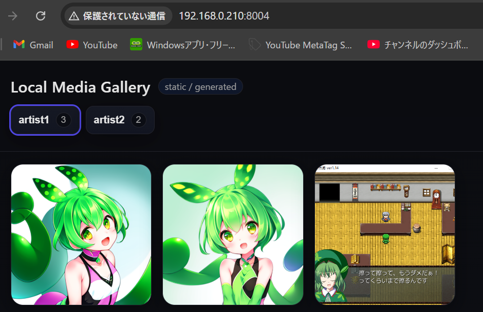
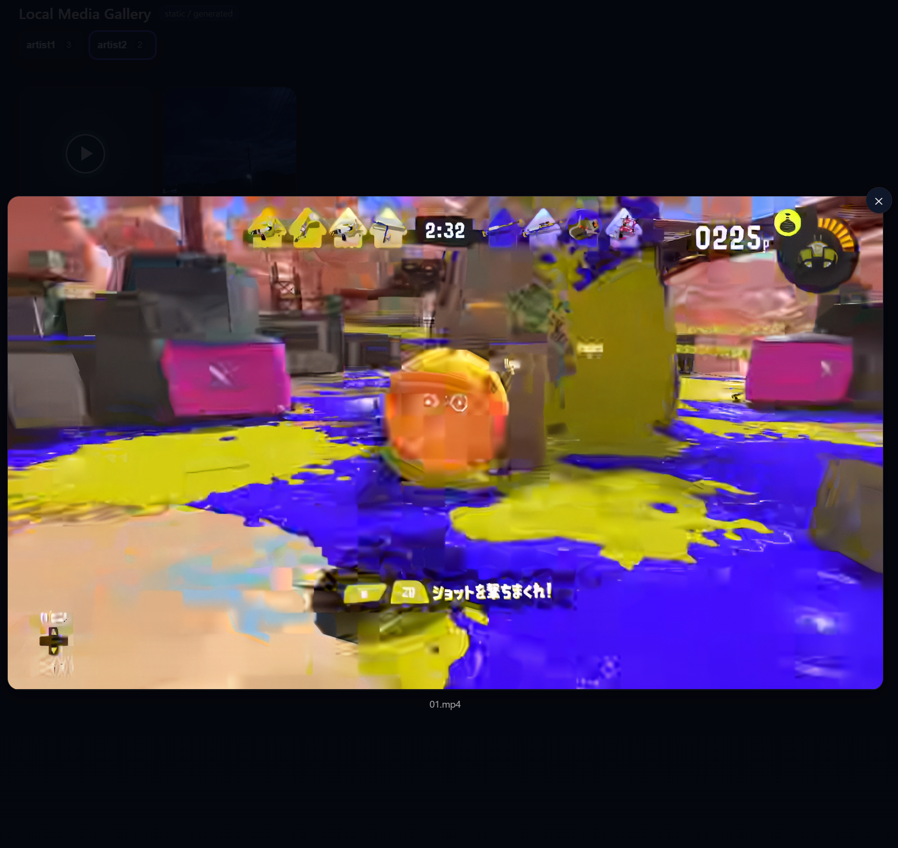

# メディアプレイヤー(汎用) v1.0

サーバー上の画像をいい感じに見れるようにするです。

Android端末で画像を見れるようにする際、VLCはサーバー対応してるが画像の表示がしづらいし、他の画像が見やすいアプリは大体サーバー上の画像が見れないので自作することにしました。

まぁほぼChatGPTがやってくれたので俺が作ったって言ったらなんか、おこがば回れって感じです(?)。

## 使い方

MediaPlayer/
　├ media/
　│　├ artist1/
　│　│　├ 01.png
　│　│　├ 02.png
　│　│　└ 03.png
　│　└ artist2/
　│　　　├ 01.mp4
　│　　　└ 02.jpg
　└ (others)

上記構成のフォルダーだとする

### 接続
make_index.batを実行してindex.htmlを生成

launch_server.batを実行してサーバーを起動(ポート番号は8004)

クライアント側でブラウザで(起動したPCのIPアドレス):8004に接続

サーバー起動後、mediaの構成の変更を適用するにはmake_index.batを実行してindex.htmlを上書き。クライアント側でF5とかして画面更新

### 動作
media直下のフォルダーごとにタブが作られ、切り替えて画像や動画の表示ができる

画像や動画をクリック(タップ)すれば、拡大してみることができる

拡大中、xボタンや枠外をクリック(タップ)すれば戻る

## サンプル画像

